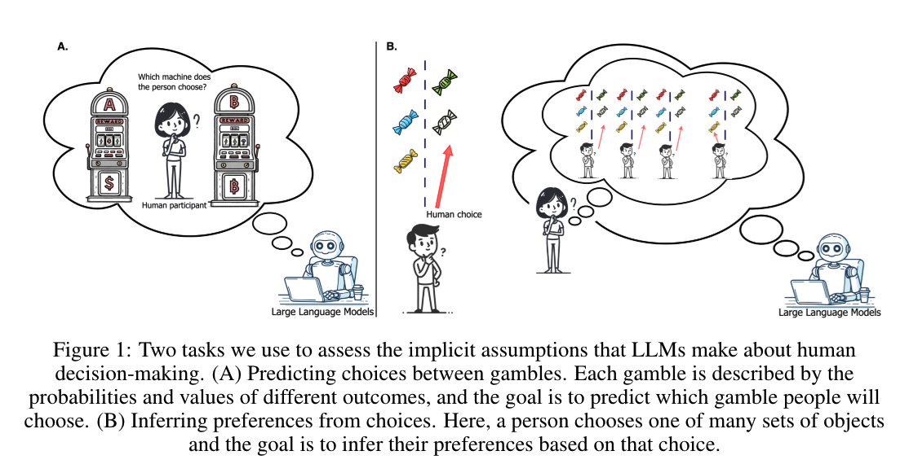

# LLM-rationality 
This repository contains the code for our paper: [Large Language Models Assume People are More Rational than We Really are](https://arxiv.org/abs/2406.17055)

Our paper consists of the forward modeling experiment (simulations and predictions) and an additional inverse modeling experiment (inferences from observing others). The forward_model, data, analysis, and open_sourced directories correspond to the forward modeling experiment. The inverse_model directory corresponds to the inverse modeling experiment. 
</img>

## 💻Running Scripts
To run the closed-source model experiments collecting data, use the following commands:

### Data
Download the choices13k dataset for forward modeling experiments from https://github.com/jcpeterson/choices13k

forward modeling: 
```shell
sh scripts.run_forward.sh
```

inverse modeling: 
```shell
./inverse_model/run_inverse.sh
```

To run analyses, use the following commands: 
forward modeling: 
```shell
sh scripts.run_forward_analysis.sh
```
inverse modeling: 
```shell
./inverse_model/run_analysis.sh
```

## 🤔Questions?
If you have any questions related to the paper or code, feel free to email Ryan {ryanliu@princeton.edu} and Jiayi {jiayig@princeton.edu}.

## 🔗Citation
Please cite our paper if you find the repo helpful in your work:
```bibtex
@article{liu2024large,
  title={Large Language Models Assume People are More Rational than We Really are},
  author={Liu, Ryan and Geng, Jiayi and Peterson, Joshua C and Sucholutsky, Ilia and Griffiths, Thomas L},
  journal={arXiv preprint arXiv:2406.17055},
  year={2024}
}
```